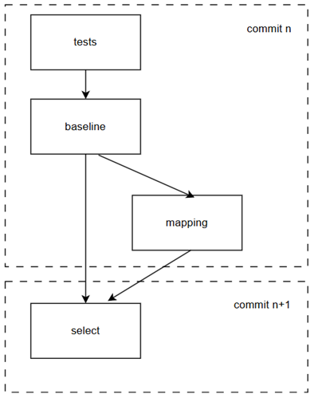
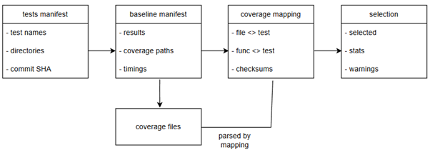

# GoRTS

**Go Regression Test Selection** — a command-line tool that reduces Go test execution cost by selecting only the tests likely affected by a code change, using per-test coverage collected at a baseline commit.

GoRTS implements a four-stage, artefact-driven pipeline. Each stage reads and writes structured JSON, so baseline collection, mapping, and selection can run independently and be reproduced in CI or research experiments.

## Why GoRTS?

Running the full test suite on every commit is expensive, especially for integration and Kubernetes end-to-end tests. Regression test selection (RTS) narrows the set of tests to those correlated with changed production code.

GoRTS is designed for Go projects that use:

- standard `go test` with instrumented binaries and `GOCOVERDIR` (Go 1.20+), or
- remote / operator-style deployments where coverage must be collected via shell hooks (for example `kubectl cp` from a pod).

The tool supports **file-level** and **function-level** selection granularity.

---

## High-level architecture

The CLI exposes four commands. Each command produces JSON consumed by the next stage.



---

## Data flow



| Stage | Input | Output | Purpose |
|-------|-------|--------|---------|
| `tests` | Test directories | `tests.json` | Discover all `Test*` functions via `go test -list` |
| `baseline` | `tests.json` | `baseline.json` + coverage dirs | Run each test serially; record pass/fail and per-test coverage path |
| `mapping` | `baseline.json` | `mapping.json` | Parse coverage; build file↔test and function↔test maps |
| `select` | `baseline.json`, `mapping.json`, git repo | `selection.json` | Diff baseline commit -> HEAD; return affected tests |

All artefacts record the git commit SHA they were generated against, so stages can be validated and replayed.

---

## Requirements

- **Go** 1.20+ (1.24+ recommended; matches `go.mod`)
- **Git** CLI (commit detection, diffs, repo validation)
- **`go tool covdata`** (coverage parsing for mapping)
- A project whose tests can produce **per-test** Go coverage data (binary mode or hook mode)

---

## Installation

```bash
git clone https://github.com/pawelpaszki/gorts.git
cd gorts
go build -o gorts .
```

Optionally install onto your `PATH`:

```bash
go install .
```

---

## Quick start

The typical workflow runs once at a **baseline commit**, then `select` is run after each subsequent change.

### 1. Enumerate tests

Run from the directory where tests are normally executed (or pass absolute directory paths):

```bash
gorts tests \
  --directories ./test/e2e,./test/integration \
  --output .cov/tests.json
```

### 2. Collect baseline coverage

**Standard Go projects** — build an instrumented test binary first:

```bash
go test -c -cover -covermode=atomic -coverpkg=./... -o test.bin ./test/e2e/...

gorts baseline \
  --manifest .cov/tests.json \
  --test-binary ./test.bin \
  --coverage-dir .cov/coverage \
  --output .cov/baseline.json \
  --retry 1
```

**Kubernetes / hook-based projects** — use pre/post hooks instead of `--test-binary` (see [Baseline execution modes](#baseline-execution-modes)).

### 3. Build coverage mapping

```bash
gorts mapping \
  --baseline .cov/baseline.json \
  --module github.com/your-org/your-module \
  --repo /path/to/your/repo \
  --output .cov/mapping.json
```

`--repo` is required for function-level checksums. Omit it for file-level mapping only.

### 4. Select tests after a code change

Check out the target commit in the tested repository, then:

```bash
gorts select \
  --baseline .cov/baseline.json \
  --mapping .cov/mapping.json \
  --repo /path/to/your/repo \
  --strip-prefix your-module/ \
  --granularity file \
  --output .cov/selection.json
```

Use `--granularity function` for finer-grained selection when function checksums were collected during mapping.

The `selection.json` file lists tests to run. Each entry includes the test directory and name, suitable for constructing `go test -run` invocations.

---

## Commands

### `gorts tests`

List all test functions (`Test*`) in the given directories.

| Flag | Required | Description |
|------|----------|-------------|
| `--directories` | Yes | Comma-separated test directories |
| `--output` | Yes | Path for `tests.json` |

---

### `gorts baseline`

Run all tests from the manifest and collect per-test coverage.

| Flag | Required | Description |
|------|----------|-------------|
| `--manifest` | Yes | Path to `tests.json` |
| `--output` | Yes | Path for `baseline.json` |
| `--coverage-dir` | Yes | Directory for per-test coverage data |
| `--test-binary` | No* | Path to pre-built instrumented test binary |
| `--pre-test` | No* | Shell command before each test |
| `--post-test` | No* | Shell command after each test |
| `--env` | No | Extra env vars (`KEY=val,KEY2=val2`) |
| `--skip` | No | Test names to skip (repeatable) |
| `--retry` | No | Max retries per failing test (default `0`) |

\* `--test-binary` and `--pre-test` / `--post-test` are **mutually exclusive**.

#### Baseline execution modes

| Mode | When to use | How coverage is collected |
|------|-------------|---------------------------|
| **Test binary** | Standard Go unit/integration tests | Run instrumented binary with `GOCOVERDIR` set per test |
| **Hook** | Remote apps (e.g. operator in a pod) | `--post-test` copies coverage from the runtime environment to `{{COVERAGE_PATH}}` |

Both modes write Go 1.20+ binary coverage files (`covmeta.*`, `covcounters.*`) under per-test subdirectories.

#### Hook template variables

Available in `--pre-test` and `--post-test`:

| Variable | Expands to |
|----------|------------|
| `{{DIR}}` | Test suite directory (e.g. `./test/e2e`) |
| `{{TEST}}` | Test function name (e.g. `TestRayJob`) |
| `{{COVERAGE_PATH}}` | Absolute path `<coverage-dir>/<parent>_<dir>/<testName>` |

---

### `gorts mapping`

Parse baseline coverage and build bidirectional mappings between tests and source code.

| Flag | Required | Default | Description |
|------|----------|---------|-------------|
| `--baseline` | No | `.cov/baseline.json` | Path to baseline artefact |
| `--output` | No | `.cov/mapping.json` | Path for mapping output |
| `--module` | Yes | — | Go module path for coverage path normalisation |
| `--repo` | No | — | Git repo path; enables function checksums and clean-state validation |

When `--repo` is set, mapping verifies the repo is checked out at the baseline commit with no uncommitted `.go` changes before computing AST-based function checksums.

---

### `gorts select`

Select tests affected by changes between the baseline commit and the current `HEAD`.

| Flag | Required | Default | Description |
|------|----------|---------|-------------|
| `--baseline` | No | `.cov/baseline.json` | Baseline artefact |
| `--mapping` | No | `.cov/mapping.json` | Mapping artefact |
| `--output` | No | `.cov/selection.json` | Selection output |
| `--repo` | Yes | — | Path to the tested git repository |
| `--strip-prefix` | Yes | — | Prefix stripped from `git diff` paths (e.g. `ray-operator/`) |
| `--granularity` | No | `file` | `file` or `function` |
| `--run-all-on` | No | — | Patterns that force a full run (e.g. `go.mod`, `Makefile`) |

**Selection logic (summary):**

1. If current commit equals baseline -> empty selection (`no_changes`).
2. If no `.go` files changed -> empty selection (`no_source_changes`).
3. If a `--run-all-on` pattern matches -> all baseline tests selected.
4. Otherwise map changed source files (or changed functions) to tests via mapping data.
5. Changed in-scope test files -> select all tests in that package.
6. Discover **new tests** in baseline directories not present in the mapping.

Function granularity falls back to file-level with a warning if checksums are unavailable.

---

## JSON artefacts

### `tests.json`

```json
{
  "generated_at": "2026-05-25T12:00:00Z",
  "commit_sha": "abc123...",
  "test_suites": [
    { "directory": "./test/e2e", "tests": ["TestFoo", "TestBar"] }
  ]
}
```

### `baseline.json`

Contains per-test results (`status`, `duration_ms`, `coverage_path`, retries/flaky flag) and suite-level summaries.

### `mapping.json`

Contains `file_to_tests`, `test_to_files`, optional `function_to_tests` / `function_checksums`, and mapping statistics.

### `selection.json`

Contains `from_commit`, `to_commit`, `changed_files`, `selected_tests`, warnings (`out_of_scope_test_files`, `no_coverage_data_packages`), and reduction statistics.

---

## Examples

### gorts-demo (test binary mode)

Small demo repository evaluated with an instrumented E2E binary. See `rq1-experiments/gorts-demo/` for commit-pair experiment scripts and artefacts.

```bash
# From gorts-demo repo at baseline commit
go test -c -cover -covermode=atomic \
  -coverpkg=github.com/pawelpaszki/gorts-demo/... \
  -o gorts-demo-e2e.test ./test/e2e/...

gorts baseline \
  --manifest .cov/tests.json \
  --test-binary ./gorts-demo-e2e.test \
  --coverage-dir .cov/coverage \
  --output .cov/baseline.json

gorts mapping \
  --baseline .cov/baseline.json \
  --module github.com/pawelpaszki/gorts-demo \
  --repo /path/to/gorts-demo \
  --output .cov/mapping.json

# After checking out a later commit in gorts-demo
gorts select \
  --baseline .cov/baseline.json \
  --mapping .cov/mapping.json \
  --repo /path/to/gorts-demo \
  --strip-prefix "" \
  --granularity function \
  --output .cov/selection.json
```

### KubeRay (hook mode)

Large operator E2E suite with coverage collected from a running pod. See `rq1-experiments/kuberay/` for full command templates per commit pair.

```bash
gorts baseline \
  --manifest .cov/tests.json \
  --coverage-dir .cov/coverage \
  --output .cov/baseline.json \
  --retry 1 \
  --pre-test "kubectl exec ... -- sh -c 'rm -rf /coverage/*'" \
  --post-test "kubectl rollout restart deployment/kuberay-operator ... && kubectl cp pod:/coverage/. {{COVERAGE_PATH}}"

gorts mapping \
  --baseline .cov/baseline.json \
  --module github.com/ray-project/kuberay/ray-operator \
  --repo /path/to/kuberay/ray-operator \
  --output .cov/mapping.json

gorts select \
  --baseline .cov/baseline.json \
  --mapping .cov/mapping.json \
  --repo /path/to/kuberay/ray-operator \
  --strip-prefix ray-operator/ \
  --granularity file \
  --output .cov/selection.json
```

---

## Running GoRTS tests

```bash
make test              # unit tests
make test-integration  # integration tests (build tags)
make test-e2e          # end-to-end tests against fixtures
make test-all          # all of the above
```

---

## Project layout

```
gorts/
├── cmd/                  # CLI commands (tests, baseline, mapping, select)
├── internal/
│   ├── coverage/         # covdata parsing, AST checksums
│   ├── exec/             # subprocess wrapper
│   ├── gitutil/          # github cli related utils
│   ├── jsonutil/         # JSON read/write utils
│   ├── model/            # JSON data models
│   └── runner/           # test execution
├── test/
│   ├── integration/      # command-level integration tests
│   └── e2e/              # full pipeline e2e tests
├── rq1-experiments/      # evaluation artefacts and scripts for RQ1
│   ├── gorts-demo/
│   └── kuberay/
└── diagrams/             # README figures (architecture, data flow)
```

---

## Design notes

- **Serial baseline execution** — tests run one at a time so each test gets isolated coverage data.
- **Artefact-driven** — JSON files decouple expensive baseline runs from fast selection.
- **Two coverage collection strategies** — the same mapping and selection logic works for local binaries and remote hook-based collection.
- **Safety valves** — `--run-all-on` for infrastructure changes; new-test discovery; out-of-scope test file warnings.

---

## Research context

GoRTS was developed as part of an MSc dissertation on coverage-guided regression test selection for Go applications. The `rq1-experiments/` directory contains reproducible commit-pair evaluations on [gorts-demo](https://github.com/pawelpaszki/gorts-demo) and [KubeRay](https://github.com/ray-project/kuberay).

---

## License

Licensed under the [MIT License](LICENSE).